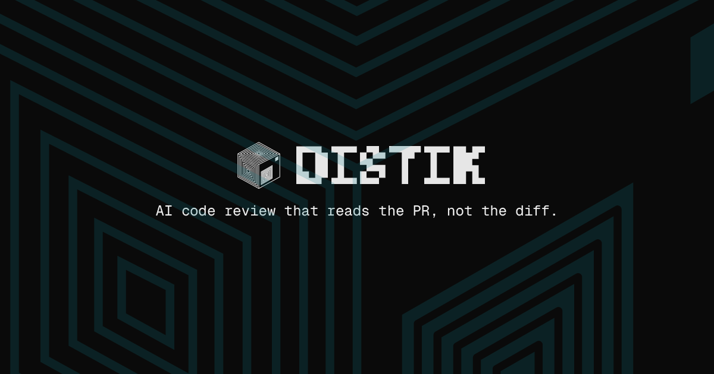

  

<h1 align="center">Distik</h1>

  <strong>See every PR's blast radius before you merge.</strong>

  <a href="https://distik.dev">distik.dev</a> &nbsp;·&nbsp;
  <a href="https://docs.distik.dev">Docs</a> &nbsp;·&nbsp;
  <a href="https://app.distik.dev">Open the app</a> &nbsp;·&nbsp;
  <a href="https://distik.dev/pricing">Pricing</a>

---

Reviewing a 2,000-line AI-generated pull request by skimming a flat diff misses intent, risk, and the dependency order between changes. Distik replaces that workflow with a structured review surface — every PR is decomposed into named, dependency-ordered chapters with intent and risk, then layered with a files heatmap, per-chapter diagrams, and a single merge-confidence number so a busy reviewer can read the change at a glance.

Distik never trains on your code. Source diffs are sent to Anthropic for chapter generation under contractual no-training terms; structured chapter analysis is cached, raw diffs are not.

## What's inside

| | |
|---|---|
| **Comprehension** | A files heatmap on the Chapters tab — tile color encodes severity, tile size encodes lines changed — plus per-chapter flow, sequence, or state diagrams. Understand the shape of the change before reading a single line. |
| **Confidence** | A 0–100 merge-confidence score with a HIGH / MEDIUM / LOW band, sitting next to the Scope heading. The reasons behind the band surface on hover. The one number a busy engineer reads. |
| **Compounding** | Every checklist item carries a thumbs-down. Click once and the model never raises that pattern for your workspace again. Distik sharpens to your team's review taste as you train it. |
| **Multi-VCS** | GitHub, GitLab, and Bitbucket — Cloud, Enterprise, and Self-Hosted. Reviewing happens in Distik's web app at app.distik.dev — nothing is posted back to your PR thread. |

## Built for teams shipping AI-generated PRs

Distik runs as a web application at [app.distik.dev](https://app.distik.dev) for engineering teams reviewing pull requests authored by Cursor, Claude Code, Copilot, and similar tools. 14-day no-card trial, then $30/seat/month or $240/seat/year.

## Find us

- **Website** — [distik.dev](https://distik.dev)
- **Documentation** — [docs.distik.dev](https://docs.distik.dev)
- **App** — [app.distik.dev](https://app.distik.dev)
- **Pricing** — [distik.dev/pricing](https://distik.dev/pricing)
- **X / Twitter** — [@distik_dev](https://x.com/distik_dev)

  Distik <code>/ˈdɪs.tɪk/</code> — code review for AI-generated PRs.

